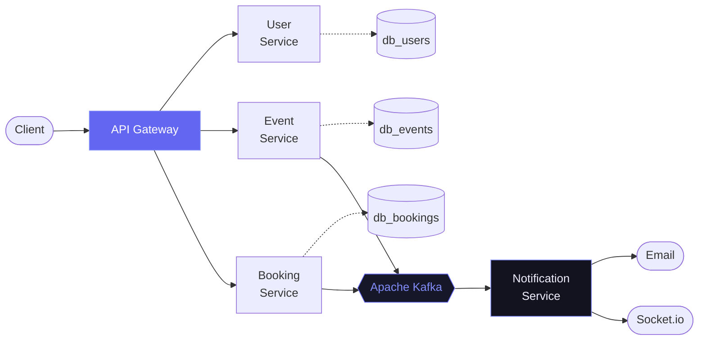

<h1 align="center">Trần Thanh Bình</h1>

  <em>Backend Engineer — I build systems that stay correct under pressure.</em>

  
  
  
  

---

### `01` — Who I am

| | |
|:--|:--|
| **Role** | Backend Engineer |
| **Education** | B.Eng. Information Technology, Hanoi University of Architecture · 2022–2027 |
| **Focus** | Distributed systems, event-driven architecture, API design |
| **Based in** | Hanoi, Vietnam |

---

### `02` — About

Backend engineer working in Node.js and TypeScript, focused on building
systems that stay correct under concurrent load.

Across my projects I've worked with:

- **Microservices** — service boundaries, database-per-service, API gateway
- **Idempotency** — duplicate request handling on retries and double-submits
- **Locking** — optimistic and pessimistic locking depending on write contention
- **Transactions** — atomic multi-step writes, event-driven compensation across services
- **Race conditions** — overselling prevention via atomic conditional updates
- **Kafka** — async workflows, decoupling services from blocking responses
- **Docker & CI/CD** — containerized services, automated build and image publishing

---

### `03` — Tech Stack

**Core**

**Data & Messaging**

**Infrastructure**

**Supporting**

---

### `04` — Activity

  
  

---

### `05` — How I build

Database-per-service, a single gateway at the edge, and Kafka carrying
everything that shouldn't block a response — email, real-time push, and
cross-service rollbacks all happen off the request path.

  <code>ttb.dev</code> · Hanoi, Vietnam

